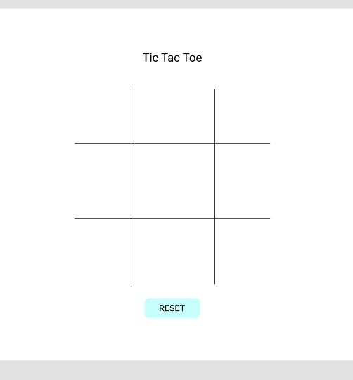
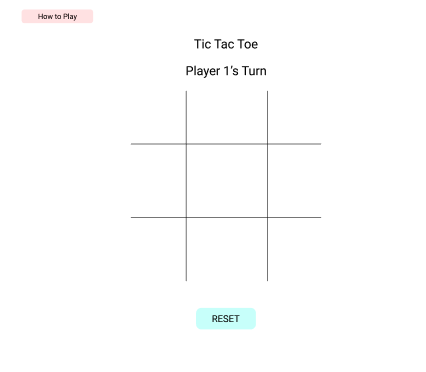

# Tic Tac Toe

## Description

A browser-based Tic Tac Toe game coded in JavaScript, HTML and CSS.

<!-- Example on how to link within readme -->
<!-- This is a link to [Google](https://google.com) -->

## Planning Process

### User Stories

#### MVP

- As a user, I want a browser-based interface so that I can play the game.
- As a user, I want the game to reach a win state so that I know who won and can play again and have the board reset for me.
- As a user, I want to place my token to that I can interact with the game.

#### Bronze

- As a user, I want to be able to see who's turn it is so that I know when to go.
- As a user, I want a scoreboard to track my win-lose count.
- As a user, I want a visual representation of who won the game in the form of highlighting the selected row/column/cross of the winner.

#### Silver

- As a user, I want the first player to be random so that it keeps the initial setting always changing.
- As a user, I want the game to store my stats so that I can access them later.
- As a user, I want there to be different difficulty levels to play against the computer.

#### Gold

- As a user, I want to be able to upload my own image as my token so that I can customize the game.
- As a user, I want the game to have a match-making system so that I can choose to play against other users, or a computer.
- As a user, I want to be able to customize the playing board theme.

#### Platinum

- As a user, I want a global match-making system so I can play with users globally.
- As a user, I want to have different variations of gameplay like 3D tic tac toe.

### Wireframes
<!-- Add images to README -->
<!--  -->

<!-- Example on how to resize the image if needed -->
<!--  -->